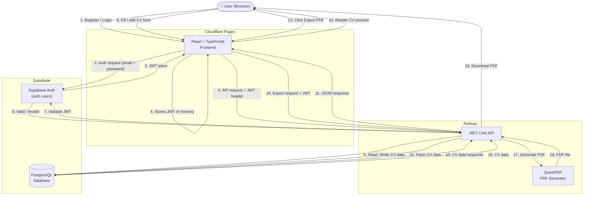
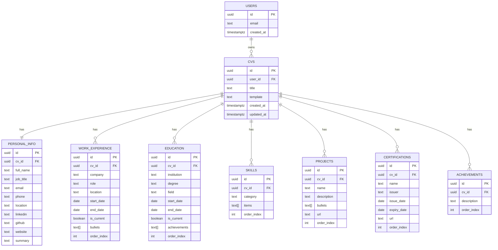

# CV Maker — Diagrams

## 1. System Data Flow Diagram

```mermaid
graph TD
    User(["👤 User (Browser)"])

    subgraph Cloudflare Pages
        UI["React + TypeScript\nFrontend"]
    end

    subgraph Railway
        API[".NET Core API"]
        PDF["QuestPDF\nPDF Generator"]
    end

    subgraph Supabase
        AUTH["Supabase Auth\n(auth.users)"]
        DB[("PostgreSQL\nDatabase")]
    end

    %% Auth flow
    User -- "1. Register / Login" --> UI
    UI -- "2. Auth request (email + password)" --> AUTH
    AUTH -- "3. JWT token" --> UI
    UI -- "4. Stores JWT in memory" --> UI

    %% CV CRUD flow
    User -- "5. Fill / edit CV form" --> UI
    UI -- "6. API request + JWT header" --> API
    API -- "7. Validate JWT" --> AUTH
    AUTH -- "8. Valid / Invalid" --> API
    API -- "9. Read / Write CV data" --> DB
    DB -- "10. CV data response" --> API
    API -- "11. JSON response" --> UI
    UI -- "12. Render CV preview" --> User

    %% PDF Export flow
    User -- "13. Click Export PDF" --> UI
    UI -- "14. Export request + JWT" --> API
    API -- "15. Fetch CV data" --> DB
    DB -- "16. CV data" --> API
    API -- "17. Generate PDF" --> PDF
    PDF -- "18. PDF file" --> API
    API -- "19. Download PDF" --> User
```

---

## 2. Database Entity Relationship Diagram

```mermaid
erDiagram
    USERS {
        uuid id PK
        text email
        timestamptz created_at
    }

    CVS {
        uuid id PK
        uuid user_id FK
        text title
        text template
        timestamptz created_at
        timestamptz updated_at
    }

    PERSONAL_INFO {
        uuid id PK
        uuid cv_id FK
        text full_name
        text job_title
        text email
        text phone
        text location
        text linkedin
        text github
        text website
        text summary
    }

    WORK_EXPERIENCE {
        uuid id PK
        uuid cv_id FK
        text company
        text role
        text location
        date start_date
        date end_date
        boolean is_current
        text[] bullets
        int order_index
    }

    EDUCATION {
        uuid id PK
        uuid cv_id FK
        text institution
        text degree
        text field
        date start_date
        date end_date
        boolean is_current
        text[] achievements
        int order_index
    }

    SKILLS {
        uuid id PK
        uuid cv_id FK
        text category
        text[] items
        int order_index
    }

    PROJECTS {
        uuid id PK
        uuid cv_id FK
        text name
        text description
        text[] bullets
        text url
        int order_index
    }

    CERTIFICATIONS {
        uuid id PK
        uuid cv_id FK
        text name
        text issuer
        date issue_date
        date expiry_date
        text url
        int order_index
    }

    ACHIEVEMENTS {
        uuid id PK
        uuid cv_id FK
        text description
        int order_index
    }

    USERS ||--o{ CVS : "owns"
    CVS ||--|| PERSONAL_INFO : "has"
    CVS ||--o{ WORK_EXPERIENCE : "has"
    CVS ||--o{ EDUCATION : "has"
    CVS ||--o{ SKILLS : "has"
    CVS ||--o{ PROJECTS : "has"
    CVS ||--o{ CERTIFICATIONS : "has"
    CVS ||--o{ ACHIEVEMENTS : "has"
```
